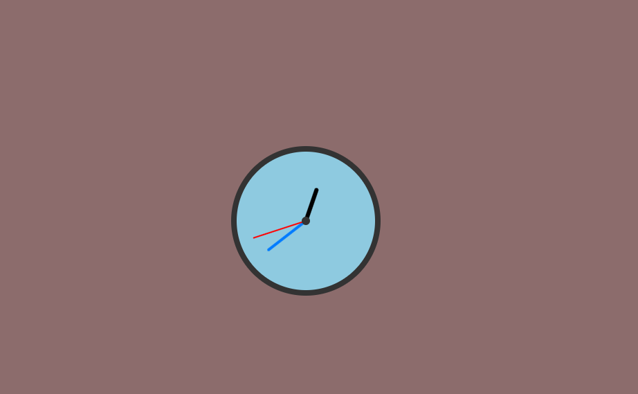

# 🕰️ Analog Clock in JavaScript

This is a real-time analog clock built using HTML, CSS, and JavaScript.

## 🔥 Features
- Real-time clock updates every second
- Smooth rotation of hour, minute, and second hands
- Responsive and simple design
- Great for learning:
  - JavaScript Date objects
  - DOM manipulation
  - CSS transforms (`translateX`, `rotate`)
  - `setInterval()` timing functions

## 📸 Preview


## 🚀 How to Run
1. Clone this repo:
   ```bash
   git clone https://github.com/kalsol17/Analog-clock.git
